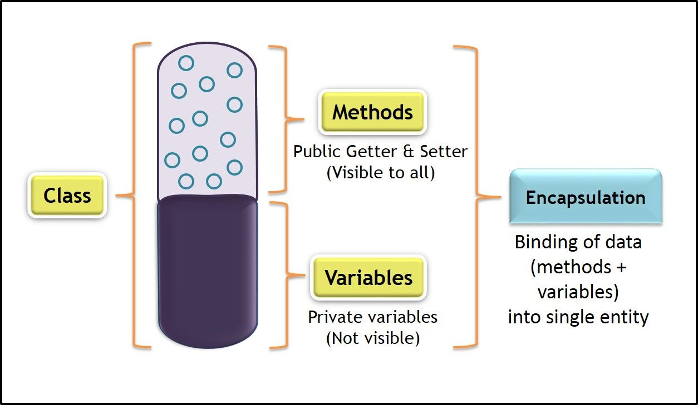

# Lab Assignment 17

In this lab you will practice working with Encapsulation.

Unlike previous labs, your class has already been created for you. 

## Let's get started!

Now let's begin!

### Encapsulation

Encapsulation is one of the main fundamental OOP concepts.

Encapsulation in Java is the process of wrapping attributes in methods. In encapsulation, attributes of a class are hidden (`private`) from other classes and can only be accessed only through its own methods.

**To Achieve Encapsulation:**
1. Declare attributes of a class as `private`.
2. Provide `public` setter and getter methods to modify and view attributes.

**Visual Example:**



**Code Example:**

```java
public class Dog {
	// Private attribute
	private String name;

	// Setter method
	public void set_name(String n) {
		name = n;
	}
	// Getter method
	public String get_name() {
		return name;
	}
}
```

For more information on encapsulation in Java visit: https://www.w3schools.com/java/java_encapsulation.asp or https://www.tutorialspoint.com/java/java_encapsulation.htm


## Your Assignment

### Securing the Class

Currently, the `Car` class being used by `Main` is NOT secure. The `Main` class has the ability to access all attributes directly and assign them any value. Let's fix that!

Encapsulate all of `Car`'s attributes (`model`, `make`, & `year`), such that they are only accessible through getter and setter methods.

**Required:** Your setter method for `year` should <ins>NOT allow</ins> years below `1886` to be assigned. Instead it should output an error message.

To pass all the test cases use the following method identifiers: `get_model()`, `set_model()`, `get_make()`, `set_make()`, `get_year()`, and `set_year()`. And your getter methods must `return` a value.

**Test Your Code:**

```
./build.sh
./test.sh
```

## Submit your assignment

To submit your lab assignment click on the **Source Control** icon (3 circles with 2 lines) on your leftside navbar. Next, click on the **+** symbol next to **Changes** to stage your changes. Lastly, add a commit message (ex: "First commit") and click **Commit** then **Sync Changes**. And you're done!